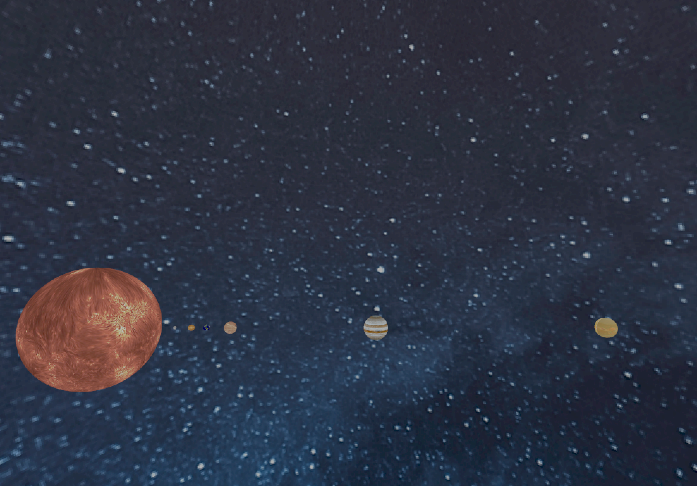

# miniRT — Ray Tracing in C

> A realistic 3D renderer using ray tracing techniques.  
> Developed as part of the 42 school curriculum — with full bonus features.

## Usage

### Build
<pre><code>make
./miniRT scenes/example.rt</code></pre>

---

## Project Breakdown

### 1.Parsing & Scene Setup

- Validate file extension, argument count
- Enforce scene constraints:
  - Exactly **1 camera**, **1 ambient light**  
  - **0 or 1** light source *(bonus: supports multiple)* 
- Accept objects in any order, whitespace-separated
- Format checked for:
  - Colors in **0–255**  
  - Normalized vectors in **[-1,1]**  
  - Positive diameters/heights 
- Parsed data stored into structured scene representations

---

### 2️.Ray Tracing & Intersections

- Viewport set up in front of the camera  
- Each screen pixel maps to a ray from the camera  
- Intersection logic implemented for:  
  - **Sphere** (`sp`)  
  - **Plane** (`pl`)  
  - **Cylinder** (`cy`)  
  - **Cone** *(bonus)*  

📐 Accurate math for intersections:  
- **Ray**: `P(t) = origin + t * direction`  
- Solving quadratics & axis projections

---

### 3️.Lighting & Shading

- **Ambient Lighting** (global base light)  
- **Diffuse Reflection** (Lambertian shading) 
- **Multiple Colored Lights** *(bonus)*  
- Shadow checks for each light  
- RGB contribution blending  
- Lighting formula:
  - FinalColor = Ambient + Σ (Diffuse + Specular per light)

- Surface Modes (Bonus Feature)

<pre><code># define MODE "SIMPLE"     // plain surfaces
# define MODE "DISRUPTION" // checkerboard effect
# define MODE "TEXTURE"    // bump map simulation</code></pre>
  - "SIMPLE": Flat, solid-color surfaces
  - "DISRUPTION": Checkerboard pattern (procedural texture)
  - "TEXTURE": Bump map lighting using perturbed normals

---
### 4️.Graphical Output (MiniLibX)

- Graphical window display  
- Interactive controls:
  - `ESC` or ❌ → quit  
  - Arrow keys → move camera  
  - A / D / W / X → rotate camera  
  - Scroll wheel → zoom in/out
  - R → reset camera

---

## Bonus

- Cone object support 
- Multiple lights with RGB colors
- Specular highlights  
- Checkerboard plane texture  
- Bump map simulation

---

## References & Resources

-  [Ray Tracing in One Weekend](https://raytracing.github.io/books/RayTracingInOneWeekend.html)  
-  [42 MiniRT Guide](https://42-cursus.gitbook.io/guide/rank-04/minirt)  
-  [Scratchapixel - Ray Tracing Intro](https://www.scratchapixel.com/lessons/3d-basic-rendering/introduction-to-ray-tracing/raytracing-algorithm-in-a-nutshell.html)  
-  [Cone Intersection](https://lousodrome.net/blog/light/2017/01/03/intersection-of-a-ray-and-a-cone/)  
-  [The Ray Tracer Challenge](http://www.raytracerchallenge.com/)  
-  [Ray Tracing in 5 Minutes - YouTube](https://www.youtube.com/watch?v=4GGRx502-iY&ab_channel=QuantitativeBytes)  
-  Bump Mapping Resources:  
  - https://medium.com/@dbildibay/ray-tracing-adventure-part-iv-678768947371  
  - http://www.raytracerchallenge.com/bonus/texture-mapping.html  
  - https://www.irisa.fr/prive/kadi/DIIC/SDI-2-annee/Cours_RayTracing/RayTracing_Texturing.pdf  

---

## 🤝 Credits

This project was developed in collaboration with [@chrisov](https://github.com/chrisov).  
Thanks for the teamwork and discussions!
